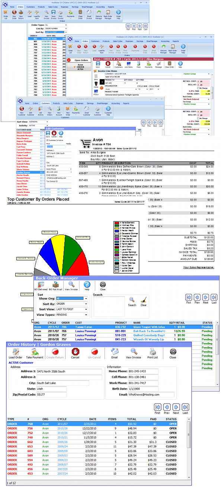

# AvoBase

**AvoBase** is a lightweight, full-featured Point of Sale (POS) and business management tool developed between 2011 and 2018. Originally designed to help Avon representatives, it expanded to support sales tracking across virtually any direct-sales organization (Scentsy, Mary Kay, Stampin' Up!, etc.) or generic small business.

For more screen shots of the application - see the /shots/ directory.

---

## 📜 Project Background & Nostalgia

I built AvoBase in 2011 using **Delphi 2009 Architect** and the **Borland Database Engine (BDE) with Paradox**. The initial launch took about 11 months of continuous work, encompassing the main software, full build scripts, the promotional website, a license key generator, and all supporting infrastructure—totaling roughly **340,000 lines of Object Pascal code**.

At its peak, AvoBase sold for $24.99 and served ~600 paying customers. Over time, changes in market dynamics brought the project to a close:

* Avon updated its EULA to prohibit third-party website/product scraping, cease and desists suck for third parties.
* Direct-sales organizations transitioned to building their own web portals for reps.
* The desktop software paradigm shifted toward modern web and mobile apps.

This was an incredibly fun, rewarding project to architect and maintain. I’ve open-sourced the entire repository under the **MIT License** for historical reference, educational reading, or code reuse. Feel free to explore!

---

## 🛠 Tech Stack & Requirements

| Component | Technology |
| --- | --- |
| **IDE / Compiler** | CodeGear Embarcadero Delphi 2009 Architect *(XE compatible)* |
| **Database Engine** | Borland Database Engine (BDE) / Paradox Databases |
| **License** | MIT License |
| **Quick Report QR5041** | Quick Report 5.041 Required and is NOT included in this Repo |

### Build & Compilation Notes

* **Project File:** Refer to `AvoBase.dpr` for executable manifests and compile directives.
* **BDE Setup:** Runs **standalone**—no full system installation required. All necessary binaries (including `idapi32.dll` and configuration files) are self-contained in the `BDE_INSTALL/` directory.

---

## ✨ Features Overview

### 🏬 Multi-Organization & Cycle Management

* **Multi-Org Support:** Manage multiple direct-sales companies simultaneously (e.g., Avon, Mary Kay, and Scentsy under one system).
* **Sales Cycles & Campaigns:** Tailored cycle tracking to map directly to specific company campaign schedules.
* **Universal Sales:** Functional as a generic POS engine for traditional micro-businesses.

### 👥 Customer Relationship Management (CRM)

* **Profiles & Habits:** Track purchasing history, birthday reminders, preferences, and custom notes.
* **Direct Communication:** Generate and email custom invoices in Adobe PDF format directly to clients.

### 📦 Products & Inventory

* **Flexible Attributes:** Custom invoice fields designed for specific organization formats (size, scent, page, oz, etc.).
* **Dynamic Adding:** Add new items to invoices on the fly without pre-populating inventory, or quickly pull existing inventory via Product IDs.
* **Sample & Stock Tracking:** Monitor sample giveaways alongside saleable inventory.

### 💳 Invoicing, Orders & Returns

* **Multi-Payment Support:** Cash, credit card, debit, money order, check, or PayPal.
* **Fee Engine:** Automatic calculation of handling and order processing fees.
* **Returns & Backorders:** Dedicated Back-Order and Return-Product Managers to restock inventory or route items back to OEM.
* **Void Handling:** Track bounced checks (NSF) and voided transactions.

### 🌐 Taxes, Shipping & Currency

* **Global Currency:** Built-in support for USD, CAD, and GBP.
* **Complex Taxation:** Unlimited Tax Groups with singular/compound rates per product, fee, or shipping tier. Supports Canadian **GST, PST, and HST**.
* **Tiered Shipping:** Flexible fixed-rate or percentage-based shipping calculations (e.g., $5 flat fee under $50; 10% rate above $50).

### 📊 Financials & Reporting

* **Expense & Earnings Tracker:** Log tax-deductible operational expenses and external earnings alongside POS revenue.
* **Comprehensive Reporting:** Over 20 built-in reports including *Earnings vs. Expenses, Taxes Collected by Cycle, Top Customers by Revenue, NSF/Voids, and Product Velocity*.

---

## 📄 Disclaimer

*Avon, Scentsy, Mary Kay, and Stampin' Up! are registered trademarks of their respective owners. AvoBase is an independent open-source project and is not affiliated with or endorsed by any of these companies.*